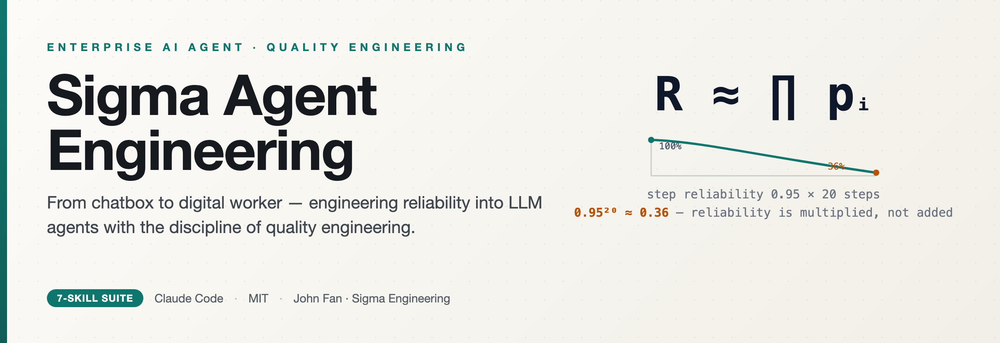
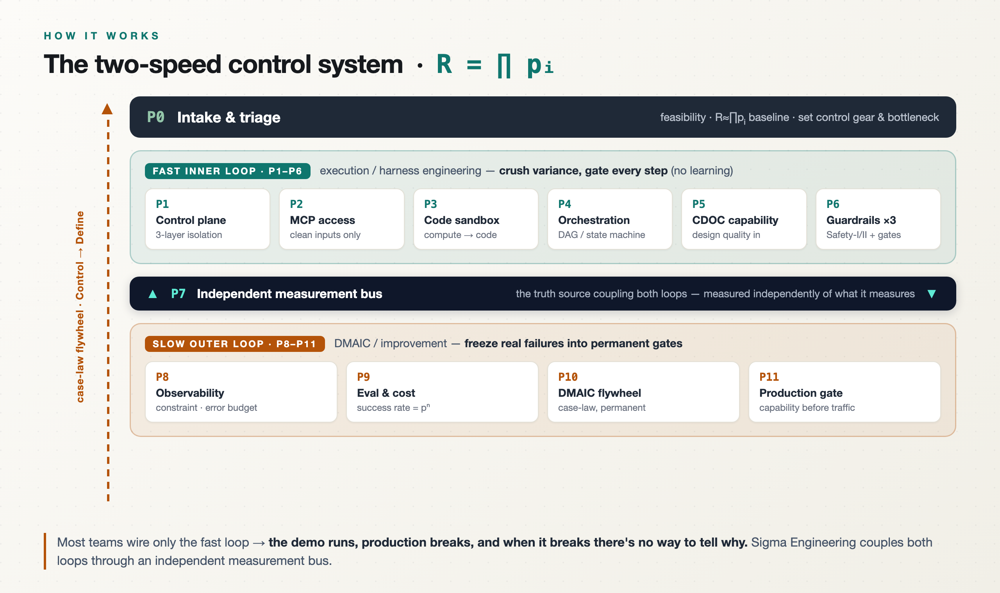
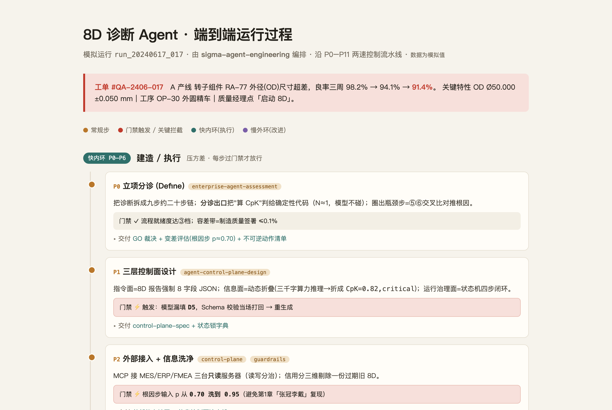
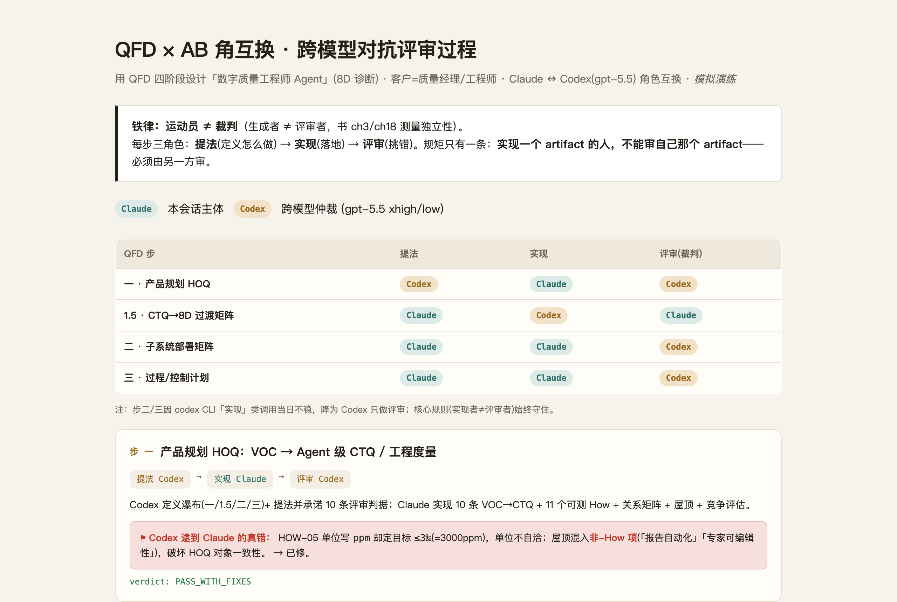

<div align="center">



[English](./README.md) | **简体中文**

[](./LICENSE)
[](https://claude.com/claude-code)


**把一个会说话但不稳定的大模型，装配成可控、可审计、运行中持续自我迭代的企业级数字作业系统。**
一个面向 [Claude Code](https://claude.com/claude-code) 的 7-skill 套件，落地《企业 AI Agent：从聊天框到数字员工》(Sigma Engineering 范式) 的方法论。

</div>

---

## 它解决什么问题

一个在聊天框里对答如流的大模型，**不是**你能放上生产线的工人。真实任务不是一个聪明回答，而是一条二十步的链 —— 而**可靠度是乘出来的，不是加出来的**：

> ### `R ≈ ∏ pᵢ`  →  `0.95²⁰ ≈ 0.36`

每步 95%、跑 20 步，整体只剩约**三分之一**。更糟的是，真实衰减比 `pⁿ` 还陡 —— 因为错误会顺着链条向下游 self-condition。

大多数团队只接了执行环、上线一个台上能跑的 demo，然后：**生产会崩，崩了无从定位。** 这不是 prompt 问题，是**可靠性工程**问题。这套 skill 给你完整流水线，像质量工程抬一条产线那样，把这条曲线抬起来。

## 怎么运作 —— 两速控制系统



- **快内环（P1–P6）** —— 执行 / *驾驭工程*。压方差、每步过门禁。不学习、不反思，只管放行或拦截。
- **慢外环（P8–P11）** —— DMAIC 改进。把每个真实失败固化成**永久**门禁，同一个 bug 永远不会上线第二次。
- **独立测量总线（P7）** —— 耦合两环的真理源，**独立于被测对象**测量（拒绝自证预言的绿测试）。
- **判例飞轮** —— `Control → Define`：每次修复都成为系统带得走的资产。

你能对这条 `∏ pᵢ` 曲线做的，只有三件事：**抬高单步可靠度**、**缩短步数**（把确定逻辑剥给代码）、**给失败兜底封顶**（Safety-I 拦可预见失效 + Safety-II 优雅降级）。这套 skill 把三件事都工程化了。

## 套件构成

主**编排器**把 6 个聚焦的子 skill 焊成一条流水线，按任务本性路由 —— **不强制**每个任务都走完十二阶段。

| Skill | 职责 | 阶段 |
|---|---|---|
| **`sigma-agent-engineering`** | 端到端**主编排器** —— 两速控制流水线 + 任务分诊 | P0–P11 |
| `enterprise-agent-assessment` | 立项分诊 / 可行性 / CDOC Concept 与能力门 | P0 · P5 |
| `agent-control-plane-design` | 三层控制面（指令/信息/运行治理）+ MCP + 沙盒 + 编排 | P1–P4 |
| `agent-guardrails-config` | 第一道防线 Safety-I 结构化护栏 + 第三道防线（记忆·权限·知识代谢） | P6 |
| `agent-human-loop-design` | 第二道防线 —— 人工复核，按**可逆性放行、非置信度** | P6 |
| `agent-observability-setup` | 独立测量总线 + 可观测性 + 评估成本 + DMAIC 判例飞轮 | P7–P10 |
| `agent-production-gate` | 规模化生产准入 —— 五步准入（能力门**先于**流量门）+ 合规 + 看板 | P11 |

## 核心方法论（4 个锚）

1. **`R ≈ pⁿ`** —— 真实写法是条件概率连乘 `R = ∏ pᵢ`；`pⁿ` 只是乐观基线。
2. **两速控制** —— 快环压方差、慢环把失败固化成门禁、测量总线耦合两环。
3. **三手段** —— 抬高 base `p` · 缩短 `N` · 兜底封顶 `⊓`（Safety-I + Safety-II）。
4. **正交轴 II · 信任与遏制** —— 对付对抗性的独立轴，**不是** `pⁿ` 随机误差。别让一个 Agent 同时握私有数据 **+** 读不可信内容 **+** 对外发送（**致命三联**）。

## 安装

```bash
git clone https://github.com/lssmi/sigma-agent-engineering-suite.git
cp -R sigma-agent-engineering-suite/sigma-agent-engineering \
      sigma-agent-engineering-suite/enterprise-agent-assessment \
      sigma-agent-engineering-suite/agent-control-plane-design \
      sigma-agent-engineering-suite/agent-guardrails-config \
      sigma-agent-engineering-suite/agent-human-loop-design \
      sigma-agent-engineering-suite/agent-observability-setup \
      sigma-agent-engineering-suite/agent-production-gate \
      ~/.claude/skills/
```

之后在 Claude Code 里提到「企业 Agent 工程化 / 数字员工 / 从立项到生产 / Sigma Engineering / R≈pⁿ」等即可触发主编排器。

## 看它跑起来

[`sigma-agent-engineering/examples/`](./sigma-agent-engineering/examples/) 里有两个**过程可视化**走查：

**制造业 8D 诊断 Agent 沿 P0–P11 走一圈**（[`8d-run.html`](./sigma-agent-engineering/examples/8d-run.html)）



**用 QFD + 跨模型对抗评审 设计「数字质量工程师 Agent」**（[`qfd-walkthrough.html`](./sigma-agent-engineering/examples/qfd-walkthrough.html)）



> ⚠️ 所有示例数据均为**模拟/示例值** —— 用于演示流水线机制与门禁，非真实生产数据。

## 来源、授权与边界

- **方法论来源**：提炼自专著《企业 AI Agent：从聊天框到数字员工》(**John Fan**，即 范玉辉 / Fan Yuhui，Sigma Engineering 范式)。作者作为权利人，将本 **skill 实现**以 MIT 协议开源。
- **授权边界**：MIT 覆盖本仓的 **skill 代码与结构**（SKILL.md / reference 编排 / 示例）。书面专著正文本身的著作权另行保留 —— 本套件是方法论的工程化落地，不是书的全文复制。
- **作者本地核验源**：仓内提到的「八审清样 `/tmp/book8/`」是作者本机书稿底稿，**未随仓发布、也无需访问**。核对数值/章节以仓内 `reference/` 已核验台账 + 正式出版书为准。
- **非官方关联**：第三方 Claude Code skill 套件，与 Anthropic 无隶属关系。**免责**：方法论与示例仅供工程参考，不构成对任何具体生产系统可靠性/合规性/安全性的保证，落地请结合自身环境验证。

## License

[MIT](./LICENSE) © 2026 John Fan · x@ainewmeth
